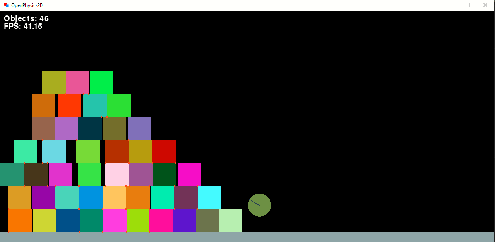

# OpenPhysics


[](http://choosealicense.com/licenses/mit/)


It's a physical 2D engine made in Python

# Install
u need python 3.10+

```pip install pygame```

```pip install pymunk```

# Controlls
LMB - Spawn a square

RMB - Spawn a circle

C - delete ALL objects in map

ESC - exit

# Authors
- [Synthous](t.me/SynthouS)

- [DTF Forum](dtf.ru)

- [ChatGPT](https://chat.openai.com/)
